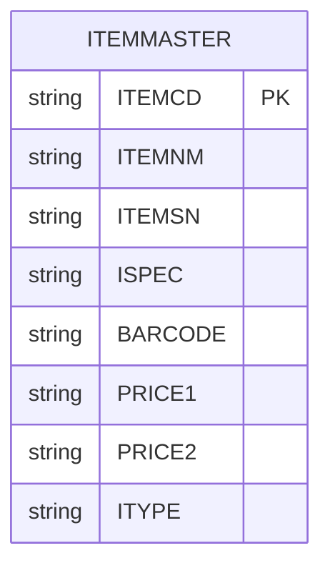

# 데이터베이스 설계 문서: 품목 관리 시스템

본 문서는 PostgreSQL 기반의 품목 관리(Item Master) 데이터베이스 설계를 정의합니다.

---

## 1. 테이블 상세 정의

### `itemmaster` (품목관리)
품목의 기본 정보, 규격, 바코드 및 단가 정보를 관리하는 테이블입니다.

| 컬럼명 | 코멘트 | 타입 | 크기 | 제약조건 | 기본값 |
| :--- | :--- | :--- | :--- | :--- | :--- |
| **ITEMCD** | 품목코드 | VARCHAR | 50 | PK, NOT NULL, UNIQUE | - |
| **ITEMNM** | 품목명 | VARCHAR | 255 | NOT NULL | - |
| **ITEMSN** | 시리얼 | VARCHAR | 50 | - | NULL |
| **ISPEC** | 규격 | VARCHAR | 255 | - | NULL |
| **BARCODE** | 바코드 | VARCHAR | 50 | - | NULL |
| **PRICE1** | 입고단가 | VARCHAR | 200 | - | NULL |
| **PRICE2** | 출고단가 | VARCHAR | 200 | - | NULL |
| **ITYPE** | 품목구분 | VARCHAR | 50 | - | NULL |

---

## 2. 테이블 간 관계 다이어그램
현재 단일 테이블로 구성되어 있으며, 향후 입출고 내역이나 재고 테이블과 연계될 수 있는 구조입니다.



---

## 3. DDL SQL (PostgreSQL)

```sql
-- 품목관리 테이블 생성
CREATE TABLE itemmaster (
    itemcd VARCHAR(50) PRIMARY KEY,
    itemnm VARCHAR(255) NOT NULL,
    itemsn VARCHAR(50),
    ispec VARCHAR(255),
    barcode VARCHAR(50),
    price1 VARCHAR(200),
    price2 VARCHAR(200),
    itype VARCHAR(50)
);

-- 코멘트 추가
COMMENT ON TABLE itemmaster IS '품목관리';
COMMENT ON COLUMN itemmaster.itemcd IS '품목코드';
COMMENT ON COLUMN itemmaster.itemnm IS '품목명';
COMMENT ON COLUMN itemmaster.itemsn IS '시리얼';
COMMENT ON COLUMN itemmaster.ispec IS '규격';
COMMENT ON COLUMN itemmaster.barcode IS '바코드';
COMMENT ON COLUMN itemmaster.price1 IS '입고단가';
COMMENT ON COLUMN itemmaster.price2 IS '출고단가';
COMMENT ON COLUMN itemmaster.itype IS '품목구분';
```

---

## 4. 설계 시 고려사항

1. **데이터 타입 최적화 (단가 컬럼)**:
   - 현재 `PRICE1`, `PRICE2`가 `VARCHAR(200)`으로 설계되어 있습니다. 금액 계산의 정확성과 정렬을 위해 향후 **`NUMERIC`** 또는 **`DECIMAL`** 타입으로 변경하는 것을 권장합니다. (예: `NUMERIC(15, 2)`)
2. **인덱스 전략**:
   - `BARCODE` 컬럼은 조회 빈도가 높을 것으로 예상되므로, 성능 최적화를 위해 **`CREATE INDEX idx_itemmaster_barcode ON itemmaster(barcode);`** 추가를 고려하십시오.
3. **데이터 무결성**:
   - `ITYPE`(품목구분)의 경우, 데이터의 일관성을 위해 별도의 코드 테이블을 생성하여 **Foreign Key(외래키)** 제약을 거는 것이 좋습니다.
4. **확장성**:
   - 시리얼(`ITEMSN`)이 품목마다 고유한지, 아니면 개별 제품마다 고유한지에 따라 설계가 달라질 수 있습니다. 만약 개별 제품 단위라면 별도의 재고/자산 테이블로 분리하는 것이 적절합니다.
5. **PostgreSQL 특성**:
   - 대소문자 구분을 명확히 하기 위해 쿼리 작성 시 컬럼명을 쌍따옴표(`"ITEMCD"`)로 감싸거나, 소문자로 통일하여 관리하는 것을 추천합니다. (위 DDL은 소문자 표준을 따랐습니다.)